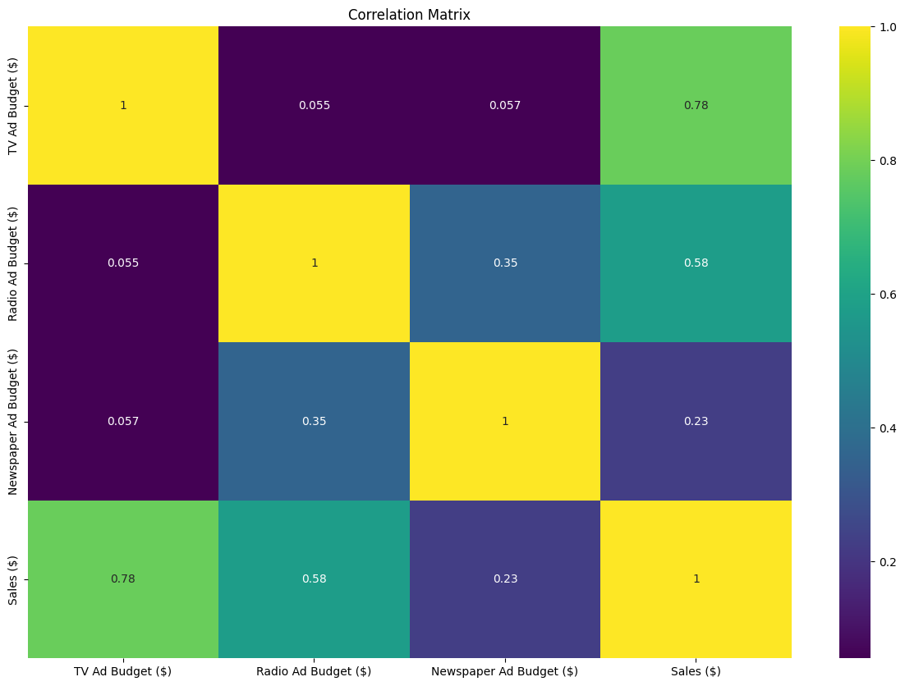
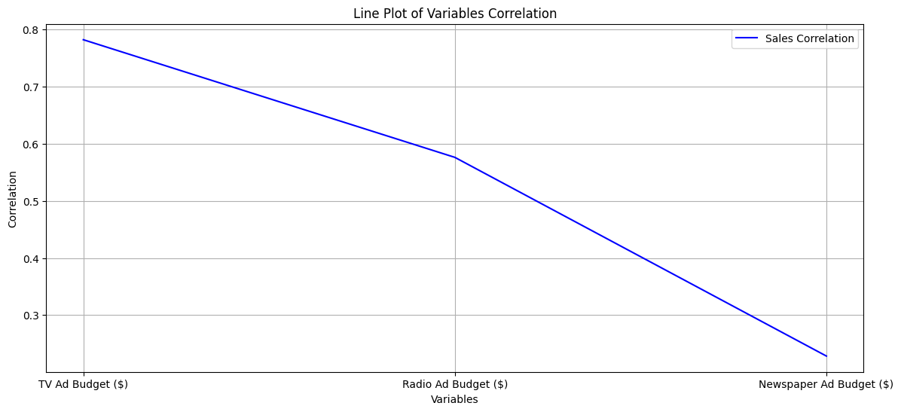
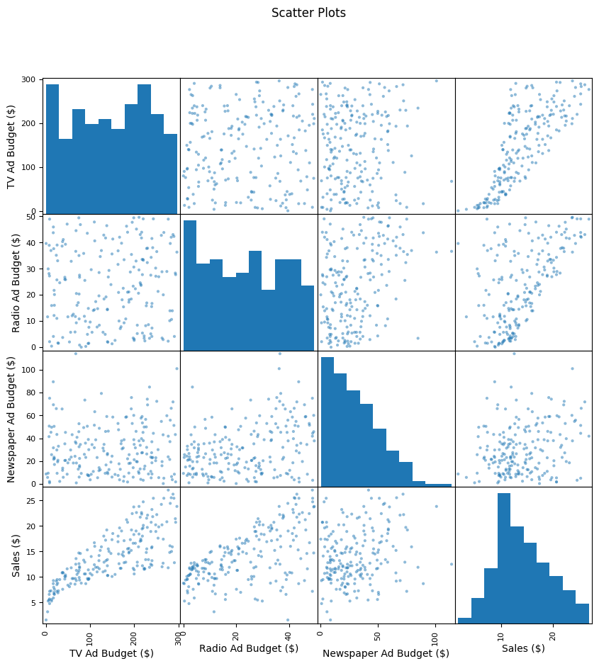
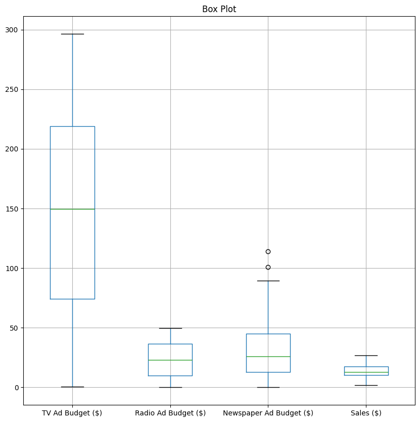
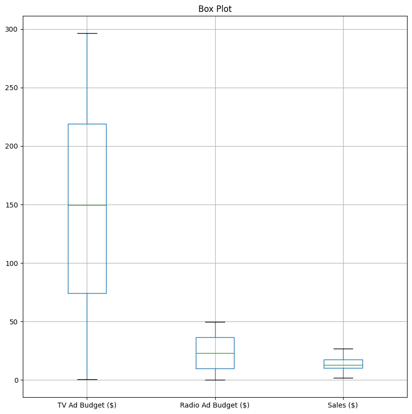
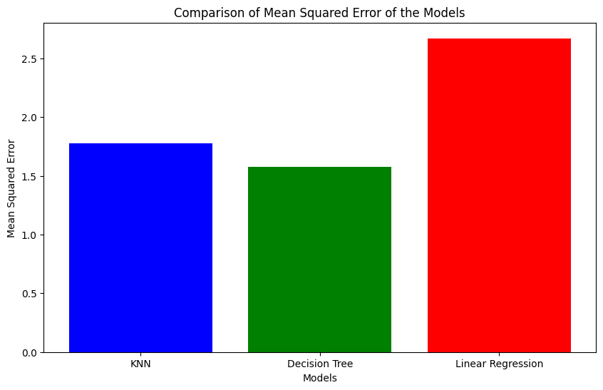
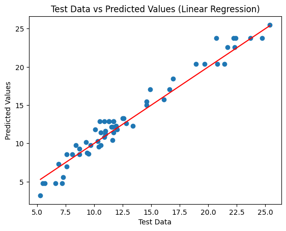

# Advertising_Budget_Sales


# Summary
This project analyzes the relationship between investments in different advertising channels (TV, radio, and newspapers) and their impact on company sales. The goal is to understand how each channel contributes to sales performance, using advertising budgets as explanatory variables and sales volume as the target variable.

# Key Insights
1. Analyzing the Sales histogram, we observed a slightly higher concentration to the left, with a slight tail to the right:


2. The correlation matrix revealed a strong positive correlation between Sales and TV Ad Budget, indicating that higher investments in TV ads are associated with higher sales. On the other hand, the correlation with Radio Ad Budget showed a moderate positive correlation, while the correlation with Newspaper Ad Budget exhibited a weak positive correlation:


3. The line chart displays the correlation between the variables, ordered from the most strongly correlated (TV Ad Budget) to the least correlated(Radio Ad Budget):


4. In the scatter plots, the most notable feature is the strong positive correlation between Sales and TV Ad Budget. The plots of Sales compared to Radio Ad Budget showed greater dispersion, while the plots of Sales versus Newspaper Ad Budget displayed even greater dispersion:


5. The analysis of the boxplot visually revealed the presence of two outliers in the Newspaper Ad Budget. These outliers could be explained by special events or campaigns where a large investment in ads was made for specific occasions:


6. After evaluating the behavior of the data, it was observed that the variable for newspaper ad spending showed a low correlation with sales which led to the decision to exclude the variable to improve the model's performance. Before excluding the newspaper ad spending variable, the z-score analysis indicated two outliers, which were also visually identified in the plots. However, it was not necessary to remove these outliers, as the variable was already excluded:


7. Three Machine Learning models were tested to predict sales: KNN (K-Nearest Neighbors), Decision Tree, and Linear Regression. The evaluation of the models was performed using the R² coefficient of determination and Mean Squared Error (MSE), through cross-validation. Although very similar to KNN, the results indicated that the Decision Tree model showed the best performance with an R² value of 94,6% and an MSE of 1.58, making it the most suitable option for the analyzed dataset, as the KNN model with an R² of 96,1% and an MSE of 1.78 carries a higher risk of overfitting:


8. Initially, the Decision Tree model presented a coefficient of determination R² = 94,6% and an Average Mean Squared Error (MSE) of 1.58. To improve performance, I performed hyperparameter optimization using GridSearchCV with cross-validation. With the optimized model, performance was significantly improved, increasing the coefficient of determination R² to 95,1% and reducing the Mean Squared Error (MSE) to 1.33. This demonstrates that the optimization enhanced the model's accuracy and reduced prediction errors. After analyzing the scatter plot, it was possible to identify alignment between the actual values and the values predicted by the optimized model. The proximity of the points to the reference line (red line) indicates the model’s strong ability to capture the data pattern. This visualization reinforces the improvement achieved through hyperparameter refinement, highlighting the model’s accuracy in predicting test values:


The formula generated by the model was as follows: Sales = (0.64 * TV advertising spend) + (0.36 * Radio advertising spend).

# Technologies Used
- Python
- Pandas
- NumPy
- Matplotlib
- Seaborn
- Jupyter Notebook
- Scipy

# How to Run

1. Clone the repository:
   ```bash
   git clone https://github.com/felipe-lemos-costa/Advertising_Budget_Sales.git
   ```

2. Install dependencies:
   ```bash
   pip install -r requirements.txt
   ```

3. Open and run the Jupyter Notebook:
   ```bash
   jupyter notebook Advertising_Budget_Sales.ipynb
   ```

# License
This project is licensed under the MIT License - see the [LICENSE](LICENSE) file for details.


